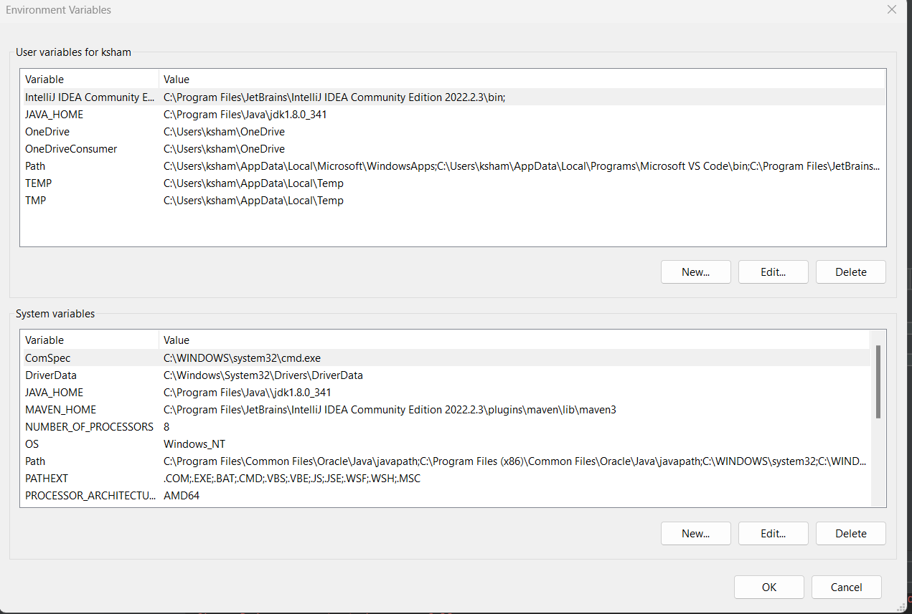
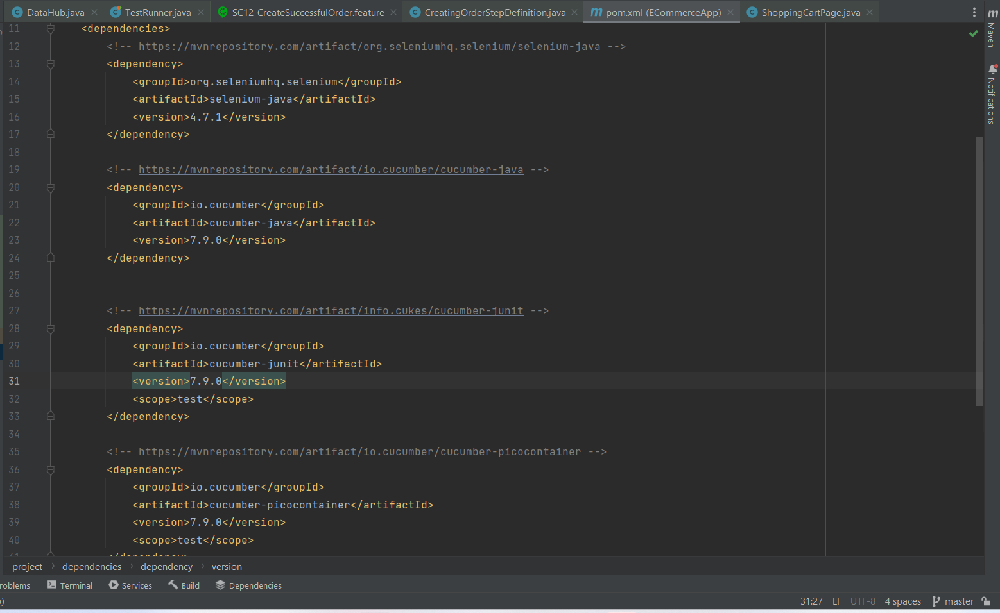
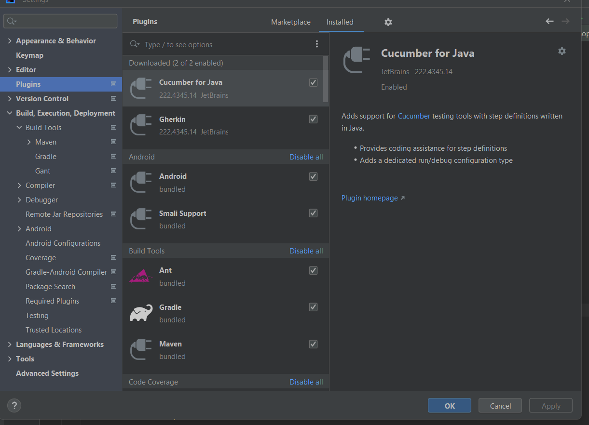

# Screenshots

## Environment

## Dependencies

## Plugins

## Test Design
[Ecommerce App Automation Testing Plan](https://docs.google.com/spreadsheets/d/1ENdAykIvCrKsVX8TBpTLmk9xehTGYHMcB_7VIkMQFZI/edit#gid=1093598114)

## Run

## Lessons Learned

* You put the shared steps in a class called `Hooks.java`: Read more: [What are Cucumber Hooks And How to Use Cucumber Hooks in Java](https://www.toolsqa.com/cucumber/cucumber-hooks/)
* You can configure the SLF4J logger. Read More: [SLF4J: 10 Reasons Why You Should Be Using It](https://stackify.com/slf4j-java/)
* You can configure to get reports using Cucumber Pretty or other tools [Official Cucumber.js Pretty Formatter - GitHub](https://github.com/cucumber/cucumber-js-pretty-formatter)
* You can then use a tool to visualize the reports and create a graphical report. One of such tools is: [Allure Framework](https://docs.qameta.io/allure/)
